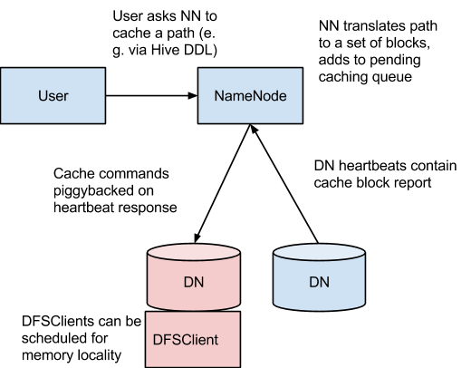

== Service Deployment and Data Storage

=== Notes on Service Deployment

This is the link:https://docs.cloudera.com/cdpdc/7.0/installation/topics/cdpdc-runtime-cluster-hosts-role-assignments.html[High Level Guide] on service deployment layout

* link:https://blog.cloudera.com/deploy-cloudera-edh-clusters-like-a-boss-revamped-part-1//[Practical advice on field deployment]
* Design principles for deployment
** Separation of concerns (administration, end users, security integration)
** Planning for growth
* Cloudera uses four role types to guide deployment
** Utility: cluster administration, integration services
** Master: executive and supervisory processes
** Worker: storage and processing
** Edge: Client access, ingestion, security perimeter
** With smaller cluster you make compromises so you have fewer nodes that are not doing processing data
** With larger cluster you want to air things out, as master services will need a lot of breathing room.

=== Layout changes with node count

* 10 nodes or fewer: costorage containersmbine master, utility & gateway roles but always keep workers separate
* 20-100 nodes: separate masters use dedicated utility & gateway nodes
* 100+ nodes: add utility, master, and gateway roles according to use case
* Once a machine is assigned to a role, adjust the resource requirements
** Master: four disks, mirror the OS volume
*** One disk for logging and other storage requirements
*** One disk for Zookeeper*
** Worker: More disks and RAM
** Gateway/Utility: VMs or older hardware can be sufficient

=== HDFS Architecture

HDFS takes standard concepts of a file systems and the link:[POSIX] standard ands applies distributed concepts to it

The main components of HDFS are:

* NameNode
** Master services that maintains metadata and orchestration
** Central metadata store hence to storage large amounts of data you need large data blocks
** Small files are an issue
* DataNode
** Worker service used to store and serve up data

image::png/hdfsarchitecture.png[[width=600]]

== High Availability

In a distributed system a Single Point of Failure (SPOF) is a bad idea as it eliminates the resilience

* Data nodes are resilient to failure
* NameNode is a single point of failure ( No Secondary NameNode does not provide resiliency )
* HDFS has a HA NameNode. More details in the link:https://hadoop.apache.org/docs/stable/hadoop-project-dist/hadoop-hdfs/HDFSHighAvailabilityWithQJM.html[documentation]
Name Node HA has 2 additional components
** Journal Node for storing and distributing edits
** Failover Controler to fence against split brain problem
* To deploy HDFS HA NameNode follow the documentation link:http://tiny.cloudera.com/hdfs-ha[NameNode HA wizard]
** In CM go to `HDFS -> Actions -> Enable High Availability`

=== HDFS Smoke Testing

* Following software installation, test hardware and network for failure
** link:http://www.michael-noll.com/blog/2011/04/09/benchmarking-and-stress-testing-an-hadoop-cluster-with-terasort-testdfsio-nnbench-mrbench/#terasort-benchmark-suite[The terasort suite]
is ideal for this: easy to apply and simple to monitor.
** Some people recommend
link:http://www.michael-noll.com/blog/2011/04/09/benchmarking-and-stress-testing-an-hadoop-cluster-with-terasort-testdfsio-nnbench-mrbench/#testdfsio[TestDFSIO, nnbench, mrbench] -- you have choices.
* Most important: corroborate performance with system tools, such as `iostat`.

== Useful capabilities of HDFS

=== Directory caching: Use case

* Cashes data into the memory of Data Nodes
** Great for repeated joins on a small table (cache effect)
* Yes the cache is off heap so GC is not an issue

More information in the link: https://docs.cloudera.com/documentation/enterprise/latest/topics/cdh_ig_hdfs_caching.html[Cloudera Documentation]

* Directory caching: Implementation

_Source: link:https://www.cloudera.com/documentation/enterprise/latest/topics/cdh_ig_hdfs_caching.html[Configuring Centralized Cache Management in HDFS]_

=== Directory caching example

[source]
----
$ hadoop fs -put myfile /user/mfernest/commons
$ sudo -u hdfs hdfs cacheadmin -addPool mfe
Successfully added cache pool mfe.
$ sudo -u hdfs cacheadmin -addDirective -path /user/mfernest/commons  -pool mfe
Added cache directive 1
$ sleep 180
----

DataNodes track blocks and report cache state to the NameNode
[source]
----
$ hdfs cacheadmin -listPools -stats mfe
...
$ sudo -u hdfs hdfs dfsadmin -report
...
----

=== HDFS Snapshots

* Users with write permissions on a directory may retrieve a deleted file
** Track changes to a directory over time
** Execute backup on an static image
** A link:http://en.wikipedia.org/wiki/Copy-on-write[copy-on-write] technique to associate each DN block with a timestamp
** Recover deleted files from a versioned folder
** Like `.Trash` folder but without an automatic purge
* link:https://hadoop.apache.org/docs/stable/hadoop-project-dist/hadoop-hdfs/HdfsSnapshots.html[Apache docs on the CLI]
* link:http://www.cloudera.com/documentation/enterprise/latest/topics/cm_bdr_snapshot_intro.html[Using Cloudera Manager] requires an active trial or Enterprise license

=== HDFS Backups

* Cloudera Manager offers BDR (Backup and Data Recovery) under its enterprise license
* BDR offers a coordinated, hardened service for backups, snapshots, and replication
** Includes configuration, monitoring, and alerting services
** Preserves file attributes and service metadata such as HMS
** Integrates with ADLSv2 and S3 coping both data and metadata back on forth
** Latest versions of BDR also copies security information with the data and includes translation from sentry to Ranger
** Basis of Replication Manager

=== Erasure Encoding

* Reduces the storage cost of replicating data 3x without penalty to resilience
* Does take a performance penalty hence only designed for cold storage
** Apache link:https://hadoop.apache.org/docs/r3.0.0/hadoop-project-dist/hadoop-hdfs/HDFSErasureCoding.html[documentation] describes the architecture and use
** Great link:https://blog.cloudera.com/introduction-to-hdfs-erasure-coding-in-apache-hadoop/[introduction blog] if you are interested

== Ozone

Ozone is another data storage technology developed by Cloudera to offer object storage capabilities

* Object stores distribute both the metadata and data alleviating small file issue

Ozone has 3 components:

* Master Components
** Ozone Manager (OM)
*** The namespace manager for Ozone
** Storage Container Manager (SCM)
*** SCM is the block manager.
SCM allocates blocks and assigns them to data nodes.
* Worker Components
* Data Nodes ( different than HDFS data nodes )
** stores and serves up blocks
** Data is organized into storage containers

image::png/ozoneBlockDiagram.png[width=500]
_Source link:https://hadoop.apache.org/ozone/docs/0.5.0-beta/index.html[Ozone Documentation]_

Data Storage hierarchy

* A data "file" is organized on blocks and referenced by a key
* Keys are organized into buckets
* Buckets are organized into Volumes
* 1 - n relationship for all of them
* No directory structure /a/b/c is fake, just a string part of the key

WHY?

* Federated namespaces to allow for multiple Ozone Managers
* Allows for billions of objects ( keys ) much more scalable
* Much happier with small files, and the data is aggregated into storage containers

Still in tech preview!

*Data loss is BAD, so don't use it in production yet!!!*