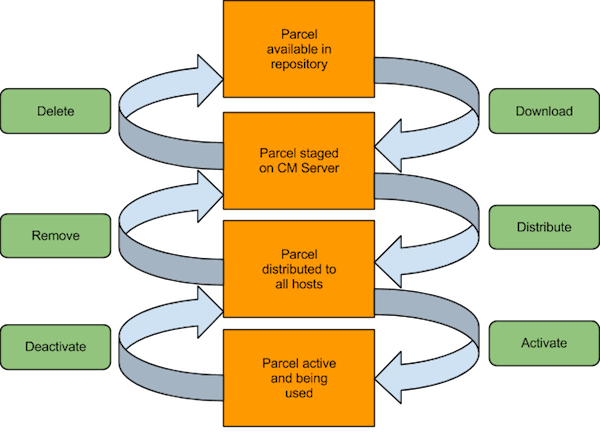

= Cloudera Manager & CDP Installation

== CM/CDP Installation

* We use Cloudera Manager in several capacities:
** To deploy CDP, Nifi, Key Trustee clusters
** To monitor the health of managed nodes and Hadoop services
** To monitor and modify property settings
** Expedite complex tasks, such as:
*** Upgrading Cloudera Manager server and agent software
*** Configuring HDFS NameNode HA
*** Integrating Kerberos & Knox
*** Enabling HDFS Encryption

== CM high-level architecture

image::png/cm_arch.png[width=600]

== CM features

* The link:https://docs.cloudera.com/cloudera-manager/7.0.3/index.html[Cloudera Manager] server provides
** An administrative console
** Links to Hadoop package and parcel repositories
** Management Services: reports, logging, auditing
*** A database server is needed to support some of these functions
** Host and Service monitoring

== Cloudera's supported installation paths

* link:https://docs.cloudera.com/cdpdc/7.0/installation/topics/cdpdc-trial-installation.html[Trial Installation Path] (f.k.a. "Path A" installation)
** Useful for short-term, throwaway projects
** Use an embedded PostgreSQL server for CM
** Uses a mish mash of other databases for CDP components
* https://docs.cloudera.com/cdpdc/7.0/installation/topics/cdpdc-installing-cm-runtime.html[Production Installation] (f.k.a. "Path B" installation)
** Any cluster that will stand for more than 3-6 months
** Supports Oracle, MySQL/MariaDB, and PostgreSQL servers
** Uses Linux packages and link:https://docs.cloudera.com/cdpdc/7.0/installation/topics/cdpdc-introduction-to-parcels.html[CM parcels]

*As a Cloudra employee there is no Trial path ...*

== Installation Steps Production Cluster

* Verifying the platform can reveal many potential bugs
* Review key hardware, disk, and network/kernel settings
* Review OS configurations and tune the system configurations
* Install a supported JDK version
* Install and configure a supported database server
* Create databases & grant CDP users access to them
** Deploy a supported JDBC connector on all nodes
* Once CM is up and running, it automates
** Distributing agent software
** Distributing CDP software
** Deploying and activating CDP services

== Installing CDP with Parcels

Parcels are link:https://github.com/cloudera/cm_ext/wiki/Parcels:-What-and-Why%3F[CM-specific code blobs]

* Core CDP components CDP Runtime in one distribution
** CM can track a list of add-on parcel locations
** Parcels are served over http
* Easier to manage than per-product Linux packages
** Default installation path is `/opt/cloudera`
* Most CDP components bind to CM through a link:https://github.com/cloudera/cm_ext/wiki/CSD-Overview[custom service descriptor]
* A parcel is just a tarball with its own link:https://github.com/cloudera/cm_ext/wiki/Building-a-parcel[manifest and layout]
** Content list: `meta/parcel.json`
** CM verifies a parcel's signature via a `manifest.json`
*** Ignores parcel if the signature doesn't match
*** `manifest.json` is only stored on the repo server
*** Each parcel file is link:http://archive.cloudera.com/cdh5/parcels/5/[specific to a Linux distribution and major release]

== Parcel Lifecycle

_Source: link:https://blog.cloudera.com/blog/2013/05/faq-understanding-the-parcel-binary-distribution-format/[Blog: FAQ: Understanding the Parcel Binary Distribution Format]_

* link:https://www.cloudera.com/documentation/enterprise/latest/topics/cm_ig_parcels.html[How to manage parcels]

* Lifecycle actions
** Download
** Distribute
** Activate/deactivate
** Remove
** Delete
* The path `/opt/cloudera/parcels/CDP` will point to the active CDP version

== link:http://www.cloudera.com/content/cloudera/en/documentation/core/latest/topics/cm_ig_installing_configuring_dbs.html[Database Support]

* Management Services
** Reports Manager
** The Host Monitor and Service Monitor use a file-based store
*** link:https://github.com/google/leveldb[LevelDB] implementation

* CDH services that need a database server
** Hue
** Hive metastore
** Oozie
** Data Analytics Studio
** Ranger

== High Availability

* A complete HA solution for Cloudera Manager and services is still an elusive target link:https://docs.google.com/document/d/1HbhpcLN_sekB-12KW-4KFnwK-nbxl74ltsVTLtVWVUA/edit#heading=h.nhlf9oqt7mft[Though working]

* link:https://www.cloudera.com/documentation/enterprise/latest/topics/admin_cm_ha_overview.html[Public documentation is here].
This procedure may or may not work depending on your version of Cloudera Manager

* The full solution requires
** A load balancer between CM servers
** Redundant network-accessible storage
** Redundant database servers
** Heartbeat Demon software (Cloudera-supported only)

* Important to note CM downtime does not equal cluster downtime.
** If Cloudera Manager is down, you can not modify or monitor the cluster though it remains healthy
** If the cluster is down than data can not be accessed or processed
** Cloudera Manager is a stateless application. All state is maintained in the backend RDBMS

Recovering a Cloudera Manager to a new node should take less than 30 minutes if the backend RDBMS is healthy

IMPORTANT: Most critical for High Availablity is the HA for the RDBMS. All production deployment should include at
minimum replication More information in the link:https://docs.cloudera.com/cdpdc/7.0/release-guide/topics/cdpdc-database-requirements.html[documentation]

HA guides for different databases:

* link:http://dev.mysql.com/doc/refman/5.5/en/replication-howto.html[MySQL]
* link:https://mariadb.com/kb/en/mariadb/setting-up-replication/[MariaDB]
* link:https://www.postgresql.org/docs/9.5/high-availability.html[Postgres]
* https://docs.oracle.com/database/121/RACAD/GUID-0014A9C2-F7E3-43D2-913E-494CAC107C03.htm#RACAD7271[Oracle]

